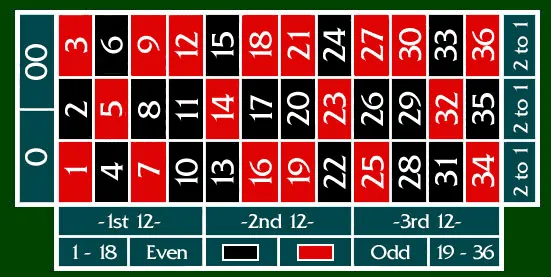

# 라스베거스 카지노에서 10배 버는 방법

내가 라스베거스 카지노에서 40달러를 400달러(64만원)으로 만든 전략을 공개하려고 한다.

# 블랙잭이 아닌 룰렛을 선택한 이유

# 전략

나는 다음과 같은 전략을 구상하였다.

다음과 같은 전략을 사용한다.

- 작은 단위의 돈을 여러 군데 걸어서 흐름을 본다. (Low Risk Low Return)
- 짝수가 연속으로 4번 나오면 다음에 홀수가 나올 것에 배팅을 크게 건다.
- 홀수가 연속으로 4번 나오면 다음에 짝수가 나올 것에 배팅을 크게 건다.
- 빨간색 숫자가 연속으로 4번 나오면 다음에 검정색 숫자가 나올 것에 배팅을 크게 건다.
- 검정색 숫자가 연속으로 4번 나오면 다음에 빨간색 숫자가 나올 것에 배팅을 크게 건다.

----------------------------------------------------------------------

# “도박사의 오류”의 오류

[https://www.ebsco.com/research-starters/sports-and-leisure/gamblers-fallacy#:~:text=The gambler's fallacy is a,individuals make more informed choices](https://www.ebsco.com/research-starters/sports-and-leisure/gamblers-fallacy#:~:text=The%20gambler's%20fallacy%20is%20a,individuals%20make%20more%20informed%20choices).

----------------------------------------------------------------------

# 초심자의 행운